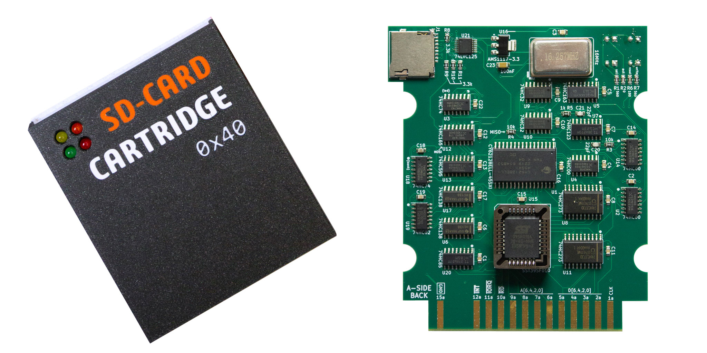
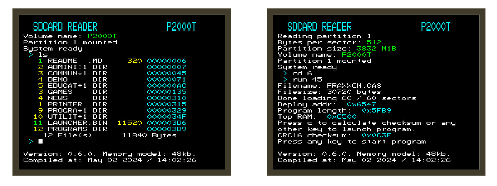
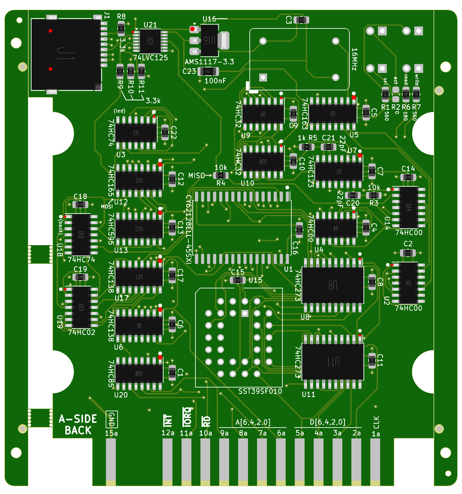

# P2000T SD-CARD cartridge


[](https://github.com/ifilot/p2000t-sdcard/actions/workflows/build.yml)
[](https://www.gnu.org/licenses/gpl-3.0)
[](https://creativecommons.org/licenses/by-sa/4.0/deed.en)

## Table of contents

* [Purpose](#purpose)
* [Downloads](#downloads)
* [How it functions](#how-it-functions)
* [Images](#images)
* [Commands](#commands)
* [Compilation instructions](#compilation-instructions)
* [Repository contents](#repository-contents)
* [Building the hardware](#building-the-hardware)
* [License](#license)

## Purpose

Perhaps the most elegant solution for loading CAS files into your P2000T or
making backups of your tapes is via a cartridge that hosts an SD-card slot. Even
the smallest SD-cards have enough capacity to store the complete P2000T tape
archive. Reading from such an SD-card is non-trivial and requires both a
hardware solution to interface with the I/O port of the P2000T as well as a
software solution to navigate through the files hosted on a FAT32 partition.
This repository contains the PCB for interfacing a P2000T with an SD-card and
the necessary software routines to grab .CAS files from said SD card and load
them into memory.

> [!WARNING] 
> Since version rev6 of the PCB, the I/O port has been changed to `0x40-0x4F`,
> while older versions of the PCB use I/O port `0x60-0x6F`. Depending on which
> version of the PCB you have, you need to use the right software packages.
> The different versions are indicated by `0x40` and `0x60`.

> [!TIP]
> **Documentation**
> * Detailed documentation included how-to procedures can be found [here](https://www.philips-p2000t.nl/cartridges/sdcard-cartridge.html#sdcard-cartridge)
> * There is also a [manual in Dutch](https://github.com/ifilot/P2000T-SD-kaart-handleiding)  available.

## Downloads 

Read the section ["How it functions"](#how-it-functions) to understand what each
download file does.

### 0x40 version

**Compatible with PCB rev6 or newer.**

> [!NOTE] 
> Do not forget to change the `LAUNCHER-0x40.BIN` to `LAUNCHER.BIN` when copying
> the file to the SD-card.

* [BASICBOOTSTRAP-0x40.BIN](https://github.com/ifilot/p2000t-sdcard/releases/latest/download/BASICBOOTSTRAP-0x40.BIN)
* [FLASHER-0x40.BIN](https://github.com/ifilot/p2000t-sdcard/releases/latest/download/FLASHER-0x40.BIN)
* [LAUNCHER-0x40.BIN](https://github.com/ifilot/p2000t-sdcard/releases/latest/download/LAUNCHER-0x40.BIN)
* [PROGRAMS.ZIP](https://github.com/ifilot/p2000t-sdcard/releases/latest/download/PROGRAMS.ZIP)
* [MULTIROM-4x16k-0x40.BIN](https://github.com/ifilot/p2000t-sdcard/releases/latest/download/MULTIROM-4x16k-0x40.BIN) (W27C512 / 64 KiB)
* [MULTIROM-32x16k-0x40.BIN](https://github.com/ifilot/p2000t-sdcard/releases/latest/download/MULTIROM-32x16k-0x40.BIN) (SST39SF040 / 512 KiB)
* [CASDUMP.PRG](https://github.com/ifilot/p2000t-sdcard/releases/latest/download/CASDUMP.PRG) (only works for 0x40 version)

### 0x60 version

**Compatible with PCB rev0-rev5.**

> [!NOTE] 
> Do not forget to change the `LAUNCHER-0x60.BIN` to `LAUNCHER.BIN` when copying
> the file to the SD-card.

* [BASICBOOTSTRAP-0x60.BIN](https://github.com/ifilot/p2000t-sdcard/releases/latest/download/BASICBOOTSTRAP-0x60.BIN)
* [FLASHER-0x60.BIN](https://github.com/ifilot/p2000t-sdcard/releases/latest/download/FLASHER-0x60.BIN)
* [LAUNCHER-0x60.BIN](https://github.com/ifilot/p2000t-sdcard/releases/latest/download/LAUNCHER-0x60.BIN)
* [PROGRAMS.ZIP](https://github.com/ifilot/p2000t-sdcard/releases/latest/download/PROGRAMS.ZIP)
* [MULTIROM-4x16k-0x60.BIN](https://github.com/ifilot/p2000t-sdcard/releases/latest/download/MULTIROM-4x16k-0x60.BIN) (W27C512 / 64 KiB)
* [MULTIROM-32x16k-0x60.BIN](https://github.com/ifilot/p2000t-sdcard/releases/latest/download/MULTIROM-32x16k-0x60.BIN) (SST39SF040 / 512 KiB)

## How it functions

To interface with the SD-card, an SD-card slot is connected to the I/O port of
the P2000T. Interfacing with the SD-card proceeds via the SPI protocol which is
encoded in hardware (in contrast to bit-banging the protocol in software). From
the perspective of the P2000T, simple 1-byte instructions can be sent and
retrieved from the SD-card. By sending specific commands, data is sent or
retrieved from the SD-card.

While the SLOT2 cartridge (which hooks up to the I/O port of the P2000T) hosts
the circuitry to interface with the SD-card, a SLOT1 cartridge is required that
hosts the software. In order to run BASIC programs that are stored on the
SD-card as `.CAS` files, the regular BASIC environment **and** the required
routines to interface with the SD-card need to be present in memory. For this
reason, a modified version of the BASIC environment is used which upon boot will
load a launcher application from the ROM chip on the SLOT2 cartridge into main
memory. This launcher application allows the user to navigate the SD-card and
load BASIC programs into memory and run these. Detailed instructions on this
process are found [here](https://www.philips-p2000t.nl/cartridges/sdcard-cartridge.html#launching-cas-programs-from-the-sd-card-cartridge).

The launcher application needs to be placed on the ROM chip by means of a
flasher program. The flasher program is a different SLOT1 cartridge which can be
downloaded from the [download section](#downloads). The flasher program will
copy a `LAUNCHER.BIN` file from the root folder of the SD-card to the ROM chip
on the SLOT2 cartridge. This procedure is also used to update the launcher
application. Details on this process can be found [here](https://www.philips-p2000t.nl/cartridges/sdcard-cartridge.html#flashing-the-launcher-onto-the-rom-chip).

It is also possible to make copies of existing tapes to the SD-card. For this
purpose, a `CASDUMP.PRG` program is written. These special types of programs can
be loaded from the SD-card and executes via the launcher application. After
completion, one automatically returns to the launcher, allowing one to load one
of the freshly copied programs.

## Images

SLOT2 cartridge enclosure and populated PCB.


Screenshots of navigation and execution of .CAS files.


## Commands

Upon booting into the LAUNCHER application, the user interfaces with the SD-card
using a set of short commands. Below, the list of commands is provided

| **Command**         | **Description**                                                   |
| ------------------- | ------------------------------------------------------------------|
| `ls`                | List contents of current folder                                   |
| `lscas`             | List contents of current folder, listing contents of CAS files    |
| `cd <number>`       | Change directory                                                  |
| `run <number>`      | Run .CAS file                                                     |
| `hexdump <number>`  | Performs a 120-byte hexdump of a file                             |
| `fileinfo <number>` | Provides location details of a file                               |
| `ledtest`           | Performs a quick test on the read/write LEDs                      |
| `stack`             | Show current position of the stack pointer                        |
| `dump<XXXX>`        | Perform a 120-byte hexdump of main memory starting at `0xXXXX`    |
| `romdump<XXXX>`     | Perform a 120-byte hexdump of cartridge ROM starting at `0xXXXX`  |
| `ramdump<XXXX>`     | Perform a 120-byte hexdump of cartridge RAM starting at `0xXXXX`  |

Note that `<number>` needs to replaced with the specific number of a file. Users
who are familiar with command line interfaces are probably used to specifying
filenames rather than numbers. This reason this approach was chosen is mainly
because it is simpler to program and furthermore a bit quicker to type.

## Compilation instructions

Compilation is done using the [z88dk Docker](https://hub.docker.com/r/z88dk/z88dk)
by means of `compile.sh`. To compile the launcher, run

```bash
cd src
./compile launcher
```

and for the flasher utility

```bash
cd src
./compile flasher
```

## Repository contents

* [Cartridge cases](cases/)
* [PCB layout files (KiCAD)](pcb/port2-sdcard-interface/)
* [Modified BASIC ROM source files](basicmod/)
* [Launcher and Flasher programs](src/)
* [Custom programs](programs/)

## Building the hardware

### Gerber files

To create your own SLOT2 cartridge, download the GERBER files from
[here](pcb/port2-sdcard-interface/GERBERS/), put them in a `.ZIP` file and send
them to your favorite PCB print farm. The author of this repository mainly uses
[JLCPCB](https://jlcpcb.com/), but plenty of alternatives are available. The
SLOT2 PCB has four layers. It is recommended to apply an ENIG (gold) coating and
chamfer the edge connector for facile insertion into the P2000T. After ordering,
one needs to either hand-solder the components (which can be tricky for the SMD
chips) or alternatively make use of an assembly service by which the PCB print
farm will solder these components for you.

### PCB assembly service

The folder [pcb/port2-sdcard-interface](pcb/port2-sdcard-interface) contains
`port2-sdcard-interface_bom_bot.csv` and `port2-sdcard-interface-bottom-pos.csv`
which can be used for the JLCPCB assembly service. An example of the part
placement can be found in the image below. At the time of writing, two
components were unavailable, being the memory chip `62128` and a 0 ohm resistor,
which is the reason that these two parts are missing. Note that all through-hole
parts, e.g. LEDs, oscillator and PLCC32 socket, have to be hand-soldered in.



### Ordering a cartridge

It is also possible to order a cartridge (typically there are always a few
of them in stock). If you are interested, feel free to contact the author of
this repository at `ivo at ivofilot dot nl` to discuss pricing and shipping.

## License


* All software is shared under the [GPL v3 license](https://www.gnu.org/licenses/gpl-3.0).
* All hardware (e.g. KiCAD files and .stl files) are shared under the [CERN-OHL-S license](https://ohwr.org/project/cernohl/-/wikis/uploads/819d71bea3458f71fba6cf4fb0f2de6b/cern_ohl_s_v2.txt).
* All documentation is shared under the [CC-BY-SA 4.0 license](https://creativecommons.org/licenses/by-sa/4.0/).
