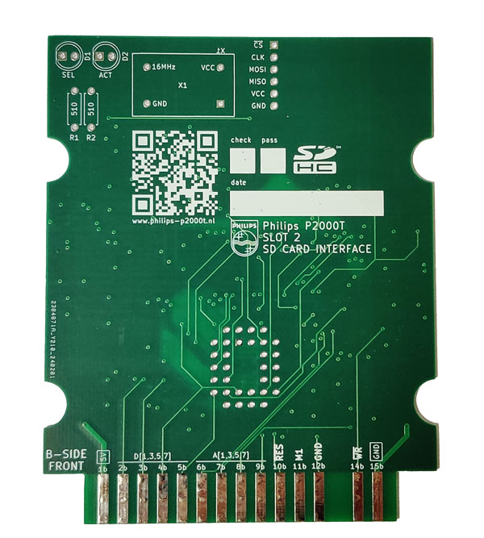
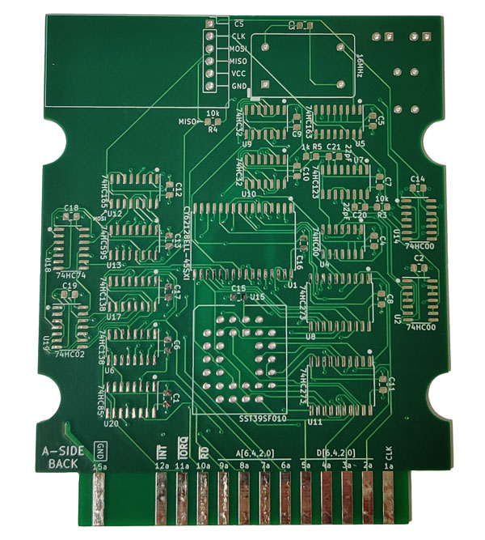
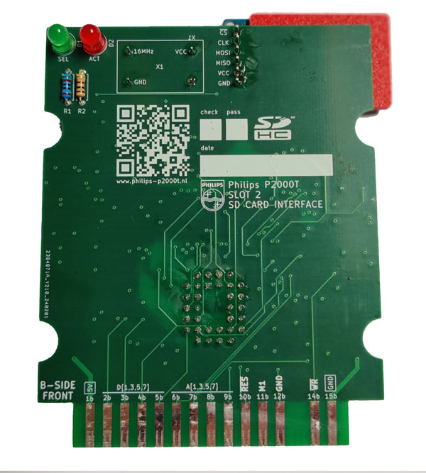
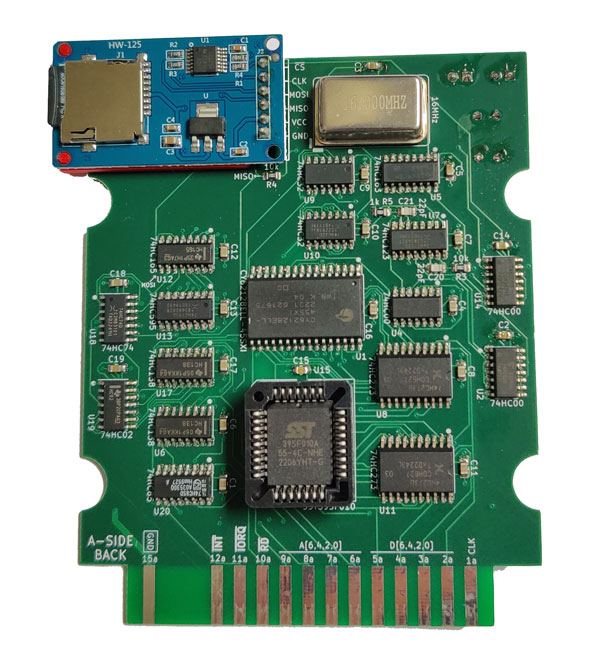

# P2000T SD-CARD cartridge

## Purpose

Launch .CAS programs from an SD-card

## Compilation

Compilation is done using the [z88dk Docker](https://hub.docker.com/r/z88dk/z88dk)
by means of `compile.sh`. To compile the launcher, run

```bash
cd src
./compile launcher
```

and for the flasher utility

```bash
cd src
./compile flasher
```

Binaries can also be directly downloaded from the releases.

* [BASICBOOTSTRAP.BIN](https://github.com/ifilot/p2000t-sdcard/releases/latest/download/BASICBOOTSTRAP.BIN)
* [FLASHER.BIN](https://github.com/ifilot/p2000t-sdcard/releases/latest/download/FLASHER.BIN)
* [LAUNCHER.BIN](https://github.com/ifilot/p2000t-sdcard/releases/latest/download/LAUNCHER.BIN)

## Images





