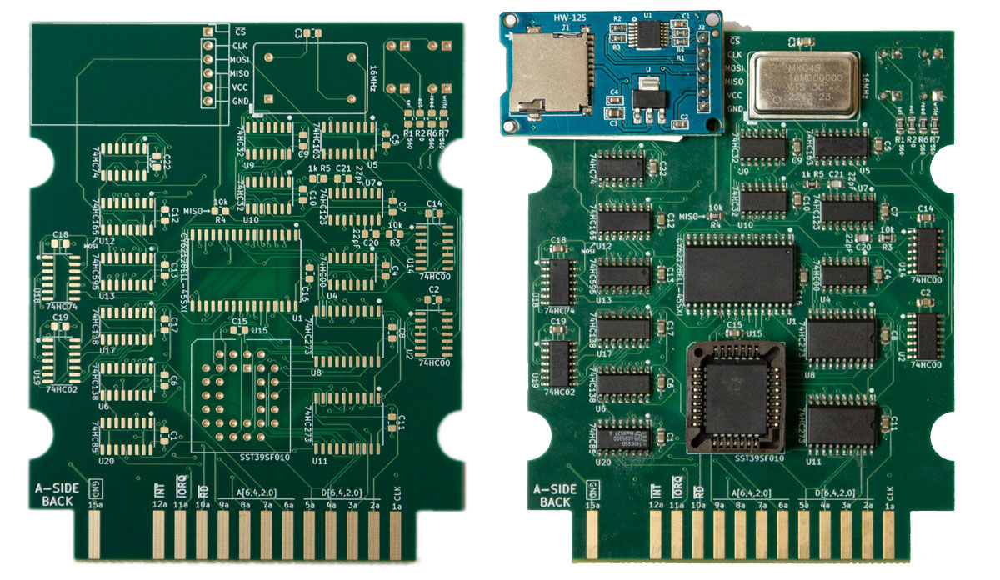
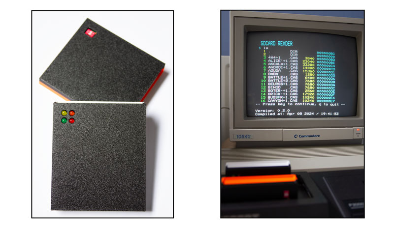

# P2000T SD-CARD cartridge


[](https://github.com/ifilot/p2000t-sdcard/actions/workflows/build.yml)
[](https://www.gnu.org/licenses/gpl-3.0)

## Purpose

Perhaps the most elegant solution for loading CAS files into your P2000T is via
a cartridge that hosts an SD-card slot. Even the smallest SD-cards have enough
capacity to store the complete P2000T tape archive. Reading from such an SD-card
is non-trivial and requires both a hardware solution to interface with the I/O
port of the P2000T as well as a software solution to navigate through the files
hosted on a FAT32 partition. This repository contains the PCB for interfacing
a P2000T with an SD-card and the necessary software routines to grab .CAS files
from said SD card and load them into memory.

> [!TIP]
> Detailed documentation can be found [here](https://www.philips-p2000t.nl/cartridges/sdcard-cartridge.html#sdcard-cartridge)

## Commands

Upon booting into the LAUNCHER application, the user interfaces with the SD-card
using a set of short commands. Below, the list of commands is provided

| **Command**         | **Description**                                                   |
| ------------------- | ------------------------------------------------------------------|
| `ls`                | List contents of current folder                                   |
| `lscas`             | List contents of current folder, listing contents of CAS files    |
| `cd <number>`       | Change directory                                                  |
| `run <number>`      | Run .CAS file                                                     |
| `hexdump <number>`  | Performs a 120-byte hexdump of a file                             |
| `fileinfo <number>` | Provides location details of a file                               |
| `ledtest`           | Performs a quick test on the read/write LEDs                      |
| `dump<XXXX>`        | Perform a 120-byte hexdump of main memory starting at `0xXXXX`    |
| `romdump<XXXX>`     | Perform a 120-byte hexdump of cartridge ROM starting at `0xXXXX`  |
| `ramdump<XXXX>`     | Perform a 120-byte hexdump of cartridge RAM starting at `0xXXXX`  |

Note that `<number>` needs to replaced with the specific number of a file. Users
who are familiar with command line interfaces are probably used to specifying
filenames rather than numbers. This reason this approach was chosen is mainly
because it is simpler to program and furthermore a bit quicker to type.

## Compilation

Compilation is done using the [z88dk Docker](https://hub.docker.com/r/z88dk/z88dk)
by means of `compile.sh`. To compile the launcher, run

```bash
cd src
./compile launcher
```

and for the flasher utility

```bash
cd src
./compile flasher
```

Binaries can also be directly downloaded from the releases.

* [BASICBOOTSTRAP.BIN](https://github.com/ifilot/p2000t-sdcard/releases/latest/download/BASICBOOTSTRAP.BIN)
* [FLASHER.BIN](https://github.com/ifilot/p2000t-sdcard/releases/latest/download/FLASHER.BIN)
* [LAUNCHER.BIN](https://github.com/ifilot/p2000t-sdcard/releases/latest/download/LAUNCHER.BIN)

## Images





## Contents

* [Cartridge cases](cases/)
* [PCB layout files (KiCAD)](pcb/port2-sdcard-interface/)
* [Modified BASIC ROM source files](basicmod/)
* [Launcher and Flasher programs](src/)
* [Custom programs](programs/)